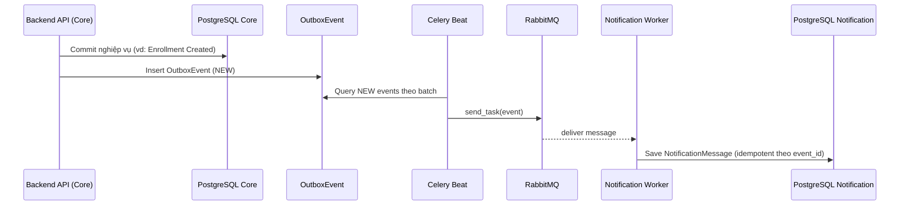

# SA25-26_ClassN01_Group12

Dự án môn **Software Architecture (SA 2025–2026)** – Nhóm 12  
Sản phẩm: **TPMS – Training Program Management System**

> Trọng tâm của repo: minh họa cách thiết kế & hiện thực một hệ thống quản lý đào tạo theo hướng **Modular Monolith** kết hợp **Microservice** và **Event‑Driven Architecture** (RabbitMQ + Celery) với **Outbox Pattern**.

---

## 1) Mục tiêu & phạm vi

TPMS hỗ trợ các nghiệp vụ chính trong quản lý đào tạo:

- Quản lý **Program** (chương trình đào tạo)
- Quản lý **Course Catalog** (môn học, prerequisites)
- Tổ chức **Term / Scheduling** (học kỳ, thời gian đăng ký)
- Quản lý **Class Section** (lớp học phần, quota, lịch)
- **Enrollment** (đăng ký / hủy đăng ký)
- **Assessment** (nhập / công bố điểm)
- **Certificate** (cấp & xác minh chứng chỉ)
- **Audit log** (theo dõi hành động hệ thống)
- **Notification** (gửi thông báo) được tách thành microservice và nhận sự kiện bất đồng bộ

---

## 2) Kiến trúc tổng thể (Big Picture)

Hệ thống áp dụng mô hình **Hybrid**:

- **Core**: *Modular Monolith* (Django + DRF) chia theo bounded-context (module), mỗi module có cấu trúc nhiều lớp.
- **Notification**: *Microservice* độc lập (Django + DRF) với DB riêng.
- **Async Integration**: RabbitMQ làm message broker; Celery dùng để publish/consume event.
- **API Gateway**: Nginx làm reverse proxy “single entrypoint” cho frontend + API + microservice.

### 2.1 Container/Deployment View (khái quát)

```mermaid
flowchart LR
  U[User/Browser] -->|HTTP| N[Nginx Gateway :80]
  N -->|/| FE[Frontend (React/Vite)]
  N -->|/api/*| BE[Backend Core (Django/DRF)]
  N -->|/ms/notification/*| NS[Notification Service (Django/DRF)]

  BE -->|SQL| DB1[(PostgreSQL Core)]
  NS -->|SQL| DB2[(PostgreSQL Notification)]

  BE -->|Celery publish| MQ[(RabbitMQ)]
  MQ -->|Celery consume| NS
```

**Lý do chọn kiến trúc này**
- Modular Monolith giúp **tách domain rõ ràng nhưng vẫn dễ triển khai** (1 service chính).
- Tách Notification sang microservice giúp:
  - giảm coupling cho tác vụ “gửi thông báo”
  - dễ scale độc lập
  - tránh làm chậm luồng nghiệp vụ chính
- Event-driven + Outbox giúp tăng **độ tin cậy** khi phát sự kiện (không mất message do lỗi tạm thời).

---

## 3) Modular Monolith theo Bounded Context

Trong `SRC/backend/modules/` mỗi domain là một “module” độc lập.

| Bounded context | Vai trò chính |
|---|---|
| `identity_access` | Auth/JWT, RBAC, quản lý user |
| `program` | CRUD chương trình đào tạo |
| `course_catalog` | CRUD course, prerequisites |
| `term_scheduling` | Term + các rule thời gian |
| `class_section` | Lớp học phần + schedule/quota |
| `enrollment` | Đăng ký/hủy đăng ký + business rules |
| `assessment` | Nhập điểm, publish điểm |
| `certificate` | Rule chứng chỉ, issue, verify |
| `audit` | Audit log / tracking |
| `shared` | Cross‑cutting concerns (API envelope, request id, outbox, tasks, middleware, exceptions, permissions…) |

### 3.1 Kiến trúc nhiều lớp trong mỗi module

Mỗi module có cấu trúc chuẩn hóa:

```
modules/<module_name>/
  presentation/      # REST API: urls, views, serializers, schemas
  application/       # Use-cases / services (orchestrate domain + infra)
  domain/            # Domain model: entities/value objects/rules
  infrastructure/    # ORM models, repositories, adapters
```

**Nguyên tắc phụ thuộc (dependency direction)**
- `presentation` → gọi `application`
- `application` → dùng `domain` + `infrastructure` (ưu tiên interface/repository pattern nếu có)
- `domain` **không phụ thuộc** vào `presentation`
- `shared` cung cấp các thành phần dùng chung (API envelope, exception, outbox, middleware, permissions…)

Mục tiêu của layered structure:
- Giữ cho “business rule” dễ test, dễ đọc
- Tránh việc REST layer (views/serializers) ôm logic nghiệp vụ
- Chuẩn bị cho khả năng “tách service theo module” trong tương lai (nếu cần)

---

## 4) Giao tiếp đồng bộ & bất đồng bộ

### 4.1 Đồng bộ (Synchronous)

Các API chính của Core Backend expose qua REST:

- `/api/v1/auth/*`
- `/api/v1/program/*`
- `/api/v1/course-catalog/*`
- `/api/v1/term/*`
- `/api/v1/section/*`
- `/api/v1/enrollment/*`
- `/api/v1/assessment/*`
- `/api/v1/certificate/*`
- `/api/v1/audit/*`

Swagger/OpenAPI (monolith):
- `/api/schema/`
- `/api/docs/`
- `/api/health`

Notification service cũng có docs/health riêng dưới gateway:
- `/ms/notification/health`
- `/ms/notification/schema`
- `/ms/notification/docs`

### 4.2 Bất đồng bộ (Asynchronous) – Event‑Driven + Outbox

Luồng tổng quát:



**Tại sao dùng Outbox Pattern?**
- Tránh tình trạng “DB commit thành công nhưng publish message thất bại” (mất đồng bộ)
- Cho phép retry publishing theo schedule
- Có trạng thái `NEW / PUBLISHED / FAILED` để quan sát và xử lý lỗi

**Idempotency**
- Backend: một số thao tác có idempotency key (đảm bảo gọi lại không tạo dữ liệu trùng)
- Notification: bảng `NotificationMessage` có `event_id` unique → duplicate event sẽ được bỏ qua (idempotent consumer)

**Một số event tiêu biểu** (được publish theo payload chuẩn hóa):
- `EnrollmentCreated`, `EnrollmentCancelled`
- `GradePublished`
- `CertificateIssued`

---

## 5) Cross‑cutting concerns (Shared)

Các thành phần quan trọng trong `modules/shared`:

- **Request/Trace ID**: middleware gắn `request_id`, propagate qua header `X‑Request‑Id` để trace end‑to‑end.
- **API response envelope**: render JSON đồng nhất dạng `{"data": ...}` hoặc `{"error": ...}`.
- **Exception model**: nhóm lỗi nghiệp vụ (BusinessRuleViolation/Conflict) tách khỏi lỗi hệ thống.
- **Outbox + Celery tasks**: publish outbox định kỳ.
- **Permissions/RBAC**: helper permission classes cho role-based access.

---

## 6) Repo structure

```
/
  README.md
  CHANGELOG.md              # changelog tổng quát (repo)
  changelog.md              # changelog theo 8 Lab (SA_v2)
  Documents/                # báo cáo, SRS, kế hoạch, weekly reports
  Design/                   # tài liệu thiết kế (nếu có)
  SRC/
    backend/                # Django/DRF Modular Monolith
    services/notification/  # Notification microservice (Django/DRF)
    frontend/               # React (Vite) + axios + router
    infra/
      docker/               # docker-compose dev/prod + env mẫu
      nginx/                # API gateway reverse proxy
    loadtests/              # k6 scripts
```

---

## 7) Chạy hệ thống (Docker Compose – DEV)

### 7.1 Chuẩn bị env
```bash
cd SRC/infra/docker
cp .env.example .env
```

### 7.2 Start stack
```bash
docker compose -f docker-compose.dev.yml --env-file .env up --build -d
```

### 7.3 Migrate + seed (tuỳ chọn)
Core backend:
```bash
docker compose -f SRC/infra/docker/docker-compose.dev.yml exec backend python manage.py migrate
docker compose -f SRC/infra/docker/docker-compose.dev.yml exec backend python manage.py seed_data
docker compose -f SRC/infra/docker/docker-compose.dev.yml exec backend python manage.py seed_demo
```

Notification:
```bash
docker compose -f SRC/infra/docker/docker-compose.dev.yml exec notification python manage.py migrate
```

### 7.4 Các URL quan trọng
- Gateway (Nginx): `http://localhost`
- Swagger (Core): `http://localhost/api/docs`
- Health (Core): `http://localhost/api/health`
- Notification docs: `http://localhost/ms/notification/docs`
- RabbitMQ management: `http://localhost:15672` (guest/guest)

---

## 8) Testing & Quality Scenarios (gợi ý)

### 8.1 Backend
- Unit/integration tests: `SRC/backend/tests/` (pytest)
```bash
cd SRC/backend
pytest -q
```

### 8.2 Frontend
- Unit tests: Vitest
- E2E tests: Playwright (`SRC/frontend/e2e/`)
```bash
cd SRC/frontend
npm test
npx playwright test
```

### 8.3 Load test (k6)
Scripts ở `SRC/loadtests/` (ví dụ read-heavy / mixed realistic).
```bash
k6 run SRC/loadtests/k6_read_heavy.js
```

---

## 9) Quy ước phát triển

- **Versioning API**: `/api/v1/...`
- **Config theo environment**:
  - Core: `config.settings.dev` / `config.settings.prod`
  - Notification: `config.settings.dev` / `config.settings.prod`
- **Mục tiêu maintainability**:
  - logic nghiệp vụ nằm trong `application`/`domain`
  - REST layer mỏng (orchestrate/validate)
  - giao tiếp liên-service dùng event (không gọi trực tiếp service khác)

---

## 10) Tài liệu liên quan

- `Documents/` – kế hoạch, SRS, weekly reports, báo cáo cuối kỳ
- `SRC/README.md` – hướng dẫn nhanh chạy dự án (stack + URLs)
- `changelog.md` – changelog theo 8 Lab (SA_v2)

---

### License / Academic note
Repo phục vụ mục đích học thuật cho môn SA (2025–2026).